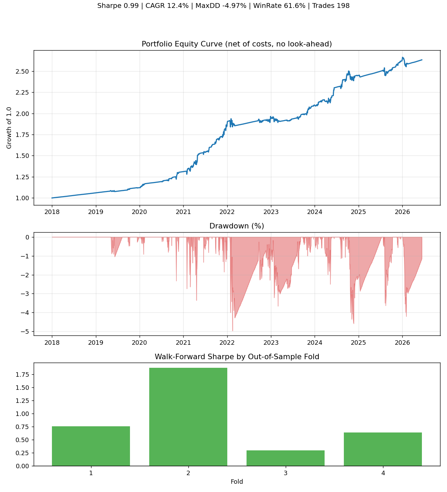

# 📈 Quant Trading System

A configurable, **rigorously backtested** mean-reversion engine with an optional
machine-learning ranking layer — built entirely on free [yfinance](https://github.com/ranaroussi/yfinance) data.

[](https://github.com/Vinayakjain7/quant-trading/actions/workflows/ci.yml)


> ⚠️ **Disclaimer:** This is a research and educational project. It is **not financial advice**.
> Backtested performance does not guarantee future results, and trading involves substantial
> risk of loss. Size positions responsibly and never risk money you cannot afford to lose.



*Generate this chart yourself on live data: `python scripts/make_results_chart.py`
(writes `docs/sample_backtest.png`). The header shows Sharpe, CAGR, max drawdown,
win rate and walk-forward Sharpe per out-of-sample fold.*

---

## Why this exists

Most hobby trading backtests quietly lie to you — they peek at future data, ignore
transaction costs, and report one suspiciously high in-sample return. This project is
built to **not** do that. Every design choice prioritizes results you can actually trust:

| Common backtest trap | How this repo handles it |
|---|---|
| Look-ahead bias | Positions decided at close of day *t* earn day *t+1*'s return (lagged by one bar). Enforced by a unit test. |
| Free-money assumptions | Commission **and** slippage charged on every entry and exit. |
| One lucky in-sample number | **Walk-forward** evaluation across out-of-sample time folds. |
| Backtest ≠ what you trade | Event-driven sim holds only the **top-N sized positions** you'd actually take, and **idle cash earns the risk-free rate** — so the Sharpe is fair, not distorted by a mostly-cash equal-weight basket. |
| Cherry-picked metrics | Sharpe (risk-free-adjusted), Sortino, max drawdown, win rate, exposure, CAGR. |
| ML that secretly cheats | Time-ordered train/test split; forward-looking label rows dropped from training. |
| Magic numbers everywhere | Everything lives in [`config.yaml`](config.yaml). |

---

## The strategy (transparent core)

A long-only, dip-buying mean-reversion strategy that only trades **with** the trend:

**Enter** when *all* hold — price above the long trend MA (uptrend), price at/below
the lower Bollinger band (a real dip), RSI oversold, and adequate volume.

**Exit** when *any* hold — price reverts to the Bollinger mean (target), an
ATR-based stop is hit (risk control), or price breaks below the trend MA (regime change).

A **market-regime filter** gates all new entries: the system only buys dips while a
breadth index of the universe is above its own 200-day MA, so it sits out broad
downturns instead of catching falling knives.

When more candidates appear than open slots allow, an **optional gradient-boosting model**
ranks them by the estimated probability of a positive forward return.

### Tuned, not guessed

The default parameters were chosen by **robustness testing**, not hand-waving. Two
research tools are included:

- `python scripts/experiment.py` — compares rule variations side-by-side on the same
  realistic engine and reports walk-forward Sharpe per fold.
- `python scripts/robustness.py` — sweeps a parameter grid and renders a heatmap, so
  you can confirm an edge is a whole *neighbourhood* of good settings, not one lucky cell.

---

## Architecture

```
run.py              # zero-install launcher: python run.py backtest|signals|ml
src/quant/
├── config.py       # load & validate config.yaml (no magic numbers)
├── data.py         # cached yfinance downloads (reproducible, offline-friendly)
├── indicators.py   # vectorized Bollinger / RSI / ATR / volume (no look-ahead)
├── strategy.py     # rule-based signal generation + regime filter
├── backtest.py     # event-driven sim: costs, slippage, metrics, walk-forward
├── ml.py           # optional ML ranking layer (leakage-guarded)
├── risk.py         # ATR position sizing, allocation caps, drawdown halt
├── cli.py          # `backtest` / `signals` / `ml` commands
└── dashboard.py    # interactive PnL / drawdown dashboard
scripts/            # experiment.py (rule comparison), robustness.py (param heatmap)
tests/              # pytest suite incl. an explicit no-look-ahead test
.github/workflows/  # CI on Python 3.10–3.12
```

---

## Quickstart

```bash
# 1. clone & install
git clone https://github.com/Vinayakjain7/quant-trading.git
cd quant-trading
python -m venv venv && source venv/bin/activate   # Windows: venv\Scripts\activate
pip install -r requirements.txt

# 2. edit config.yaml to set your universe & parameters (works for NSE, US, crypto…)

# 3. run a rigorous backtest
python run.py backtest               # run from repo root

# 4. get today's ranked BUY candidates with position sizing
python run.py signals

# 5. train & evaluate the ML ranker
python run.py ml

# 6. render the PnL dashboard from your trade log
python -m quant.dashboard --trades outputs/trades.csv --out outputs/dashboard.html
```

> `run.py` is a zero-install launcher. If you prefer the `python -m quant.cli ...`
> form (or the `quant` command), install the package first with `pip install -e .`.

---

## Configuration

Everything is driven by [`config.yaml`](config.yaml). Want US stocks instead of NSE?
Replace the ticker list. Want a tighter stop or more aggressive sizing? Change the
`risk` section. A few of the knobs:

```yaml
strategy:
  bb_window: 20        # Bollinger lookback
  bb_std: 1.5          # band width
  trend_ma: 200        # trend filter (robustness-tested)
  rsi_max_entry: 35    # only buy deeper dips (robustness-tested)
  regime_filter: true  # sit out broad market downturns
  regime_ma: 200
risk:
  risk_per_trade: 0.02 # never risk >2% of capital per trade
  atr_stop_mult: 2.0   # stop = entry − 2×ATR
  max_positions: 5
  max_drawdown: -0.10  # halt new trades past −10%
backtest:
  commission_bps: 3    # be realistic about costs
  slippage_bps: 5
  risk_free_rate: 0.06 # idle cash earns this; Sharpe is measured against it
```

---

## Output metrics

```
=== PORTFOLIO BACKTEST (top-N sized, costs, cash earns rf, no look-ahead) ===
   total_return_pct : ...
           cagr_pct : ...
             sharpe : ...
            sortino : ...
   max_drawdown_pct : ...
       win_rate_pct : ...
         num_trades : ...
       exposure_pct : ...

=== WALK-FORWARD (out-of-sample folds) ===   <- consistency across periods
```

---

## Roadmap

- [ ] Sector / market-cap neutral portfolio weighting
- [ ] Intraday and weekly rebalance options
- [ ] Broker API hooks for paper trading (execution stays manual by design)
- [ ] Hyperparameter sweep with proper nested cross-validation

---

## Contributing

Issues and PRs welcome. Run `pytest -q` before submitting — CI must stay green.

## License

[MIT](LICENSE). For research and education only; not financial advice.
